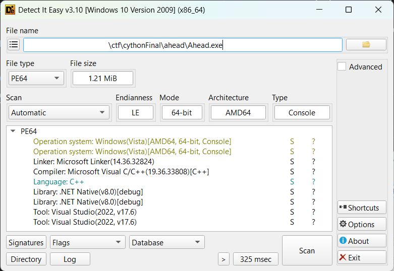

# Ahead
* category: reverse engeneering.
* diffucilty: Hard.
* this challange took me much time to solve it, but I learnt alot from this challange.
# Solution
## file type

* Die identify its as .NET native, so it's not possible to use dnspy. Refer to this link https://harfanglab.io/insidethelab/reverse-engineering-ida-pro-aot-net/

