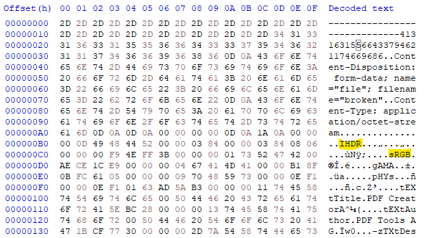
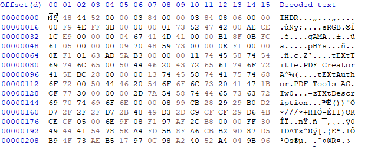
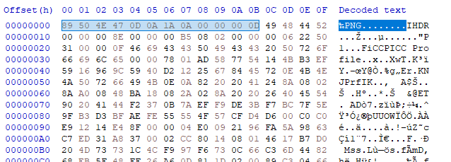
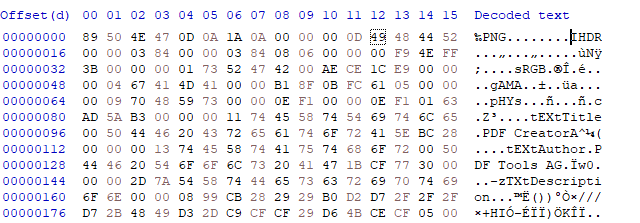

challange ```Broken```

* In this challange we got pcap file.
* Follow tcp stream, will recognise file being uploaded.
* Use the "File" menu and select "Export Objects" -> "HTTP" and save the file.
* let's open the file in hex editor (I'm using HxD) and check the file.



* there is signs that this file is PNG (highlighted) but the file is corrupted.
* remove all bytes before ```IHDR```.



* from another png image copy all bytes before ```IHDR```.



* paste the copied bytes in broken file.



* open broken image and you will see the flag.